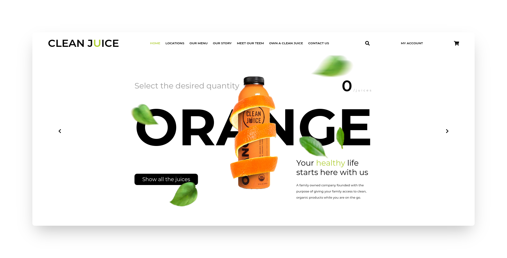

<p align="center">
  Landing page with Parallax.js using React.js.
</p>

## Tech

- [TypeScript](https://github.com/microsoft/TypeScript) - TypeScript is a superset of JavaScript that compiles to clean JavaScript output.
- [React](https://reactjs.org) - A JavaScript library for building user interfaces.
- [Styled Components](https://styled-components.com/) - ES6 and CSS to styled components.
- [Font Awesome](https://fontawesome.com/how-to-use/on-the-web/using-with/react) - Font Awesome React component.
- [Parallax.js](https://www.npmjs.com/package/parallax-js) - Parallax Engine that reacts to the orientation of a smart device.
- [Prettier](https://prettier.io/docs/en/cli.html) - An opinionated code formatter.
- [ESlint](https://eslint.org) - ESLint statically analyzes your code to quickly find problems.

## Development setup

### Prerequisites

To run this project in the development mode, you'll need to have a basic environment with Node.Js and Yarn installed.

#### Cloning the Repository

```
git clone https://github.com/fariasmateuss/clean-juice.git
```

### Installing

Run to install the dependencies;

```
yarn
```

To start the project;

```
yarn start
```

Open http://localhost:3000 with your browser to see the result.

## Feedback

You can check out [my profile on Linkedin](https://www.linkedin.com/in/fariasmateuss/) - your feedback and contributions are welcome!

# License

[MIT License](/LICENSE)
